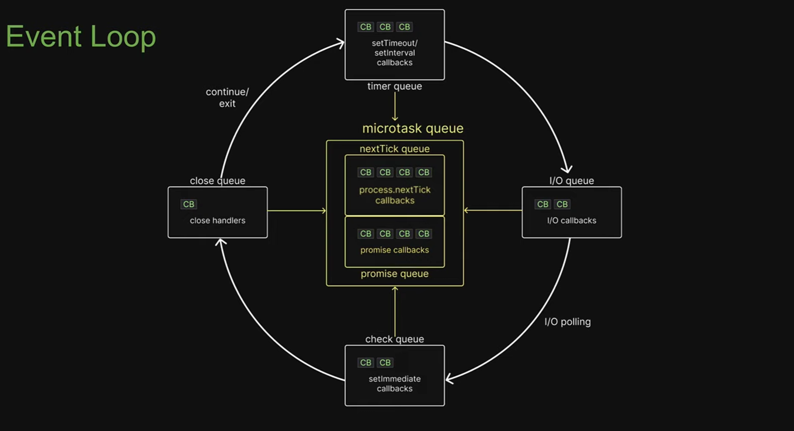

## Lesson 41 - Event Loop
- It is a C program and is part of libuv
- A design pattern that orchestrates or co-ordinates the execution of synchronous and asynchronous code in Node.js

### Execution Order
- User written synchronous JS code takes priority over async code that the runtime would like to execute
- Only after the call stack is empty, the event loop comes into picture
- If there are more callbacks to be processed, the loop is kept alive for one more run and the same steps are repeated
- On the other hand, if all callbacks are executed and there is no more code to process, the event loop exits.

### Execution Order Within Loop
1. Any callbacks in the micro task queues are executed. First, tasks in the ***nexTick queue*** and only then tasks in the ***promise queue***
2. All callbacks within the ***timer queue*** are executed
3. Callback in the micro task queues if present are executed. Again, first tasks in the ***nexTick queue*** and only then tasks in the ***promise queue***
4. All callbacks within the ***I/O queue*** are executed
5. Callbacks in the micro task queues if present are executed.***nexTick queue*** followed by ***promise queue***
6. All callbacks within the ***check queue*** are executed
7. Callbacks in the micro task queues if present are executed.***nexTick queue*** followed by ***promise queue***
8. All callbacks within the ***close queue*** are executed
9. For one final time in the same loop, the micro task queues are executed. ***nexTick queue*** followed by ***promise queue***

